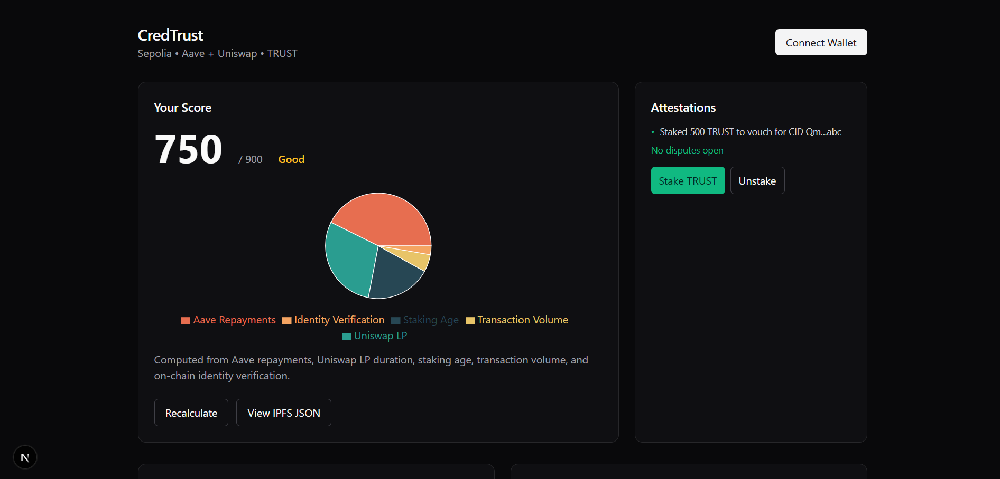

# CredTrust - Decentralized Credit Scoring System


## Overview
CredTrust is a decentralized credit scoring protocol that converts on-chain behavior into verifiable crypto credit scores. This MVP demonstrates how blockchain activity can translate into a transparent, user-owned credit score for DeFi applications.

[](https://credtrust.vercel.app)

## Key Features
- On-Chain Credit Scoring: Converts blockchain activity into a verifiable credit score
- Score Visualization: Interactive charts showing score composition
- Attestation System: Stake TRUST tokens to vouch for your score credibility
- Credit Gate: Demo system that gates access based on credit score
- IPFS Integration: Verifiable score data stored on decentralized storage
- Wallet Integration: Connect with any Web3 wallet

## Tech Stack
**Frontend**
- Next.js 14 (App Router)
- TypeScript
- Tailwind CSS
- Recharts
- Wagmi + Web3Modal

**Blockchain**
- Ethereum (Sepolia testnet)
- The Graph (for on-chain data indexing)
- IPFS (for decentralized storage)
- Smart Contracts (Solidity)

**Design**
- Geist Font
- Dark Mode UI
- Responsive Layout

## Getting Started
**Prerequisites**
- Node.js v18+
- npm
- Web3 wallet (MetaMask, Coinbase Wallet, etc.)

**Installation**
1. Clone the repository:
```bash
git clone https://github.com/your-username/credtrust-mvp.git
cd credtrust-mvp
```

2. Install dependencies:
```bash
npm install
```

3. Start the development server:
```bash
npm run dev
```

4. Open your browser and visit:
```text
http://localhost:3000
```

5. Configuration
Create a .env.local file in the root directory with the following environment variables:
```bash
cp .env.example .env
```

## Project Structure
```text
src/
├── app/                   # Main application
│   ├── components/        # Reusable components
│   │   ├── AttestationsCard.tsx
│   │   ├── CreditGateModal.tsx
│   │   ├── ScoreCard.tsx
│   │   ├── ScoreChart.tsx
│   │   ├── StakeModal.tsx
│   │   └── WalletButton.tsx
│   ├── ClientBody.tsx     # Client-side body component
│   ├── globals.css        # Global styles
│   ├── layout.tsx         # Root layout
│   └── page.tsx           # Home page
├── lib/
│   └── utils.ts           # Utility functions
public/                    # Static assets
```

## How It Works
CredTrust demonstrates a decentralized credit scoring system:

1. Data Aggregation: Collects on-chain data from:
  - Aave loan repayments
  - Uniswap liquidity provisioning
  - Staking history
  - Transaction patterns

2. Score Calculation: Computes a credit score based on:
  - Payment history (40%)
  - Liquidity duration (30%)
  - Staking consistency (20%)
  - Transaction volume (5%)
  - Identity verification (5%)

3. Verification & Storage:
  - Scores stored on IPFS with content-addressable IDs
  - Hashes anchored to Ethereum blockchain
  - Fully auditable and recalculatable

4. Attestation System:
  - Users stake TRUST tokens to vouch for their score
  - Malicious actors risk losing stakes
  - Community-driven dispute resolution

5. Credit Applications:
  - Lenders can gate access based on credit score
  - Demo shows under-collateralized loan eligibility

## Usage Guide
1. Connect Wallet:
  - Click "Connect Wallet" in the top right
  - Select your preferred wallet provider
  - Sign the connection request

2. View Your Score:
  - See your current credit score (750/900 by default)
  - View score composition in the interactive chart
  - Recalculate to see potential score changes

3. Stake TRUST Tokens:
  - Click "Stake TRUST" in the Attestations card
  - Adjust the slider to select amount
  - Confirm to create an attestation

4. Test Credit Gate:
  - Click "Try Credit Gate" in the Demo Consumer card
  - See if you qualify for under-collateralized loans
  - Get personalized feedback to improve your score

5. Inspect IPFS Data:
  - Click "View IPFS JSON" in Your Score card
  - See the verifiable data behind your score

## Future Development
- Integrate with The Graph for real on-chain data
- Implement smart contract interactions
- Add dispute resolution system
- Create score delegation functionality
- Develop DAO governance for algorithm updates

## Acknowledgements
This project was inspired by the need for decentralized credit systems in Web3 and builds on concepts from:
  - Aave Credit Delegation
  - Chainlink Oracle Networks
  - Kleros Dispute Resolution
  - Zero-Knowledge Proof concepts for privacy

---

CredTrust - Building trust in the decentralized world